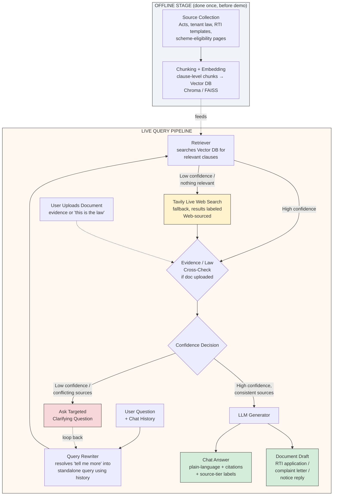

# Nyaya Sahayak (न्याय सहायक) — AI for Civic & Legal Empowerment

[](https://www.python.org/)
[](https://fastapi.tiangolo.com/)
[](https://www.trychroma.com/)
[](https://opensource.org/licenses/MIT)

> **Hackathon Submission**: Problem Statement 3 (PS3) — *AI for Civic and Legal Empowerment* (IIIT Allahabad Hackathon).

---

## 📌 Submission Checklist

| Requirement | Details / Link |
| :--- | :--- |
| 🌐 **Live / Hosted Prototype Link** | [http://localhost:8000](http://localhost:8000) *(Local)* / [https://nyaya-sahayak.onrender.com](https://nyaya-sahayak.onrender.com) *(Hosted)* |
| 📁 **GitHub Repository** | [https://github.com/1919-14/nyaya-sahayak](https://github.com/1919-14/nyaya-sahayak) |
| 🎥 **Demo Video (MANDATORY)** | **[Click Here to Watch Demo Video (Max 10 Mins)](https://github.com/1919-14/nyaya-sahayak)** |

---

## 🚀 Project Overview

**Nyaya Sahayak** is an intelligent, conversational AI platform designed to bridge the gap between everyday citizens and complex legal/civic rights in India. Moving from *"I don't understand my situation"* to a **clause-cited, grounded answer** and a **ready-to-file legal document** (RTI application, formal complaint letter, notice reply).

### 💡 Why Nyaya Sahayak Beats Plain RAG Chatbots
Most naive RAG implementations simply index PDFs and repeat matching text. **Nyaya Sahayak differentiates on four key fronts:**

1. **Conversational Memory & Query Rewriting**: Follow-up questions like *"tell me more"* or *"what is the fee?"* are dynamically rewritten into standalone queries based on session history rather than repeating identical retrievals.
2. **Evidence-Aware Document Intake**: Users can upload notices, receipts, or screenshots. The system extracts structured facts and merges them into conversation context rather than treating user claims as blind truth.
3. **Verified Fallback & Provenance Labeling**: If local vector retrieval confidence is low, the platform seamlessly triggers a live structured web search (via Tavily) and tags sources by trust level (**Verified DB**, **Web-Sourced**, **Unconfirmed**).
4. **Anti-Hallucination Cross-Questioning**: When information is ambiguous or incomplete, the AI **refuses to fabricate answers** and instead asks a targeted, clarifying question with tappable choices.

---

## 🏗️ System Architecture



---

## 🛡️ Anti-Hallucination & Legal Compliance Guardrails

Nyaya Sahayak incorporates multi-layered technical guardrails to prevent model hallucinations and maintain strict legal compliance:

### 1. Anti-Hallucination Mechanisms
* **Strict Grounded Generation**: The system prompt forces the LLM to act purely as a grounded information synthesizer. Factual claims must be directly traceable to indexed source chunks and cited inline as `[1]`, `[2]`.
* **Confidence-Gated Escalation Thresholds**: Vector similarity scores are evaluated on Chroma cosine distances (0–1). If similarity is below `0.45`, the system avoids guessing and either triggers web fallback or asks a clarifying question.
* **Source-Tier Conflict Resolution**: When web search results conflict with verified local legal database chunks, the prompt forces the model to prioritize verified legal data and explicitly report discrepancies.
* **Document Verification Protocol (`cross_check_uploaded_law`)**: User-uploaded legal text ("This is the law") is cross-checked against vetted vector DB entries using an LLM fact-checker before being accepted into conversation context. Unverified claims are explicitly flagged.

### 2. Legal & Regulatory Compliance Guardrails
* **Role Boundary & Disclaimer Enforcement**: Prominently displays disclaimers (*"Consultation Room — Not a Lawyer"* and *"Not legal advice"*) across the letterhead and chat composer.
* **Non-Binding Guidance**: Operates strictly as a civic awareness, information lookup, and document drafting assistant—never issuing binding legal counsel or pretending to act as a licensed practitioner.
* **Plain Language & Accessibility**: Answers are re-phrased into everyday vocabulary without confusing legalese, with an optional "Explain Simpler" feature for low reading levels.

---

## ✨ All Core Features & Technical Highlights

* 🤖 **Streaming Token Generation**: Real-time token streaming over Server-Sent Events (SSE).
* 🌐 **Interactive Web Search Toggle (`🌐 Web Search`)**: User-controlled toggle button in the input bar to explicitly force live web retrieval via Tavily AI Search.
* 💡 **Clickable Follow-Up Suggestions**: Automatically extracts follow-up questions and displays them as interactive pill buttons under the heading **"You might also want to know / ask:"** placed above citation badges.
* 🛡️ **Source-Tier Color Badging**:
  * 🟢 **Verified Legal DB**: Clauses retrieved from ingested government Acts (RTI Act 2005, Consumer Protection Act 2019, Code on Wages 2019).
  * 🔵 **Web Search Result**: Real-time supplementary web results with clickable direct URL links.
  * 🔴 **Unconfirmed**: Claims extracted from user uploads that have not been independently verified.
* 📝 **Automated Legal Document Generator**: Auto-drafts ready-to-file RTI Applications and Formal Complaints prepopulated with applicant details and session facts.
* 🗣️ **Bilingual & Voice Input Support**: Full English and Devanagari Hindi (`हिं`) toggle with browser-native Web Speech API voice input.
* 🔍 **"Explain Simpler" Mode**: Lowers reading difficulty for complex legal answers while retaining original factual citations.

---

## 🛠️ Tech Stack

* **Backend**: Python 3.11, FastAPI, Uvicorn, SQLite
* **RAG & Embeddings**: ChromaDB, Sentence-Transformers (`all-MiniLM-L6-v2`)
* **LLM Engine**: Groq / OpenAI-compatible Chat Completions API (`llama-3.3-70b-versatile`)
* **Web Search API**: Tavily Search API
* **Frontend**: Vanilla HTML5, Modern CSS3 (Glassmorphism & CSS Variables), ES6 JavaScript

---

## ⚙️ Local Installation & Run Instructions

### Prerequisites
* Python 3.11+ installed on your system
* Git

### 1. Clone the Repository
```bash
git clone https://github.com/1919-14/nyaya-sahayak.git
cd nyaya-sahayak
```

### 2. Create Virtual Environment & Install Dependencies
```bash
# Windows
python -m venv venv
.\venv\Scripts\activate

# Linux/macOS
python3 -m venv venv
source venv/bin/activate

# Install dependencies
pip install -r requirements.txt
```

### 3. Environment Configuration
Create a `.env` file in the root directory (refer to `.env.example`):
```env
LLM_API_KEY=gsk_your_groq_or_openai_api_key
LLM_BASE_URL=https://api.groq.com/openai/v1
LLM_MODEL=llama-3.3-70b-versatile

# Optional: Enables live web fallback search
TAVILY_API_KEY=tvly-your_tavily_api_key
```

### 4. Build Knowledge Base & Vector Store (Offline Stage)

**Option A: Ingest Official Government Acts (Recommended)**
```bash
python ingest/download_and_build.py
```
*Downloads RTI Act 2005, Consumer Protection Act 2019, Code on Wages 2019, and welfare scheme docs from official `*.gov.in` sites, extracts text, chunks, and builds the Chroma vector database at `data/chroma/`.*

**Option B: Quick Ingestion from existing local raw text**
```bash
python ingest/ingest.py
```

### 5. Launch Application
```bash
uvicorn app.main:app --reload --port 8000
```

### 6. Access the Application
Open your browser and navigate to:
👉 **`http://localhost:8000/`**

---

## ☁️ Free Cloud Deployment Guide (Render / Koyeb)

Since FastAPI is configured to serve the static frontend directly at `/`, you can host the entire application on **Render (Free Tier)** with a single Web Service:

1. Create a **New Web Service** on Render connected to your GitHub repository.
2. **Build Command**: `bash build.sh`
3. **Start Command**: `uvicorn app.main:app --host 0.0.0.0 --port $PORT`
4. Add `LLM_API_KEY`, `LLM_BASE_URL`, `LLM_MODEL`, and `TAVILY_API_KEY` under **Environment Variables**.

---

## 🔌 API Endpoint Reference

| Method | Endpoint | Description |
| :--- | :--- | :--- |
| `GET` | `/` | Serves the frontend web app (`index.html`) |
| `GET` | `/health` | Sanity check endpoint returning LLM model status |
| `POST` | `/chat/stream` | Main streaming RAG chat loop over SSE |
| `POST` | `/simplify/stream` | Re-expresses last turn answer at lower reading level |
| `POST` | `/upload` | Intake & cross-check evidence/law PDF or text documents |
| `POST` | `/draft` | Auto-generates structured RTI or Complaint document |
| `GET` | `/sessions` | Returns list of all persistent chat sessions |
| `GET` | `/session/{id}` | Fetches message history for a specific session |
| `DELETE` | `/session/{id}` | Deletes a saved chat session permanently |

---

## 📄 License

Distributed under the MIT License. See `LICENSE` for more information.
